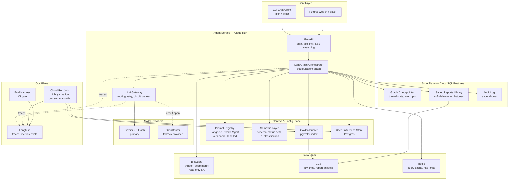
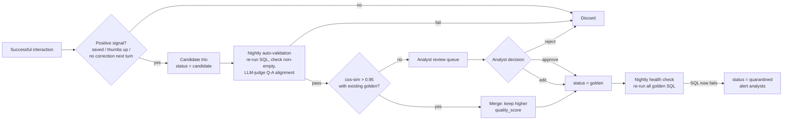
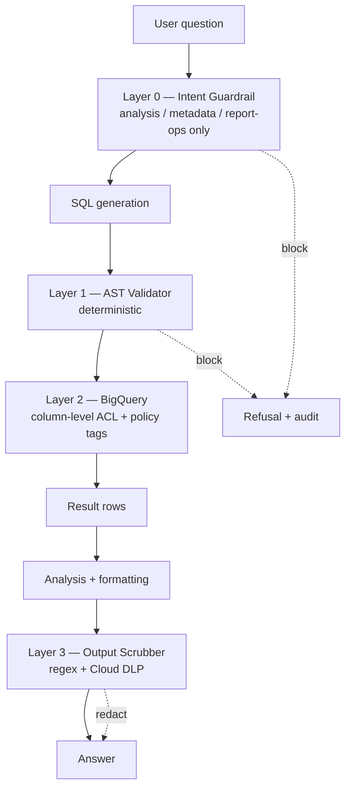
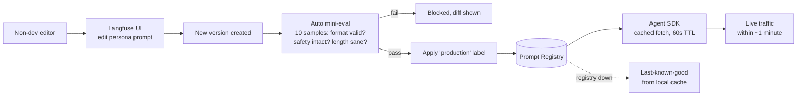
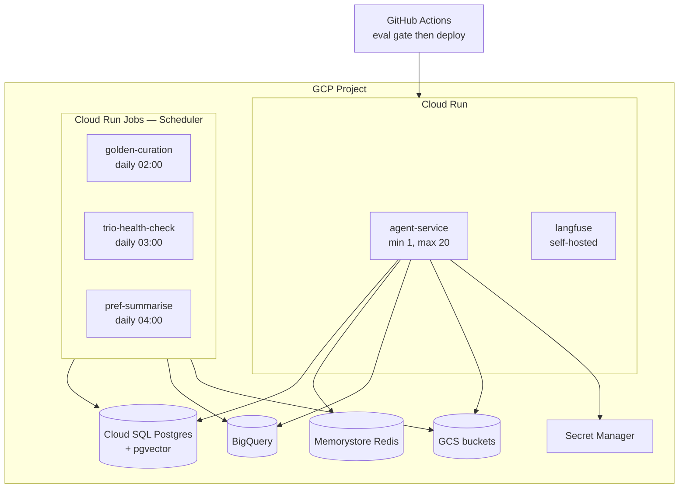

# Retail Analytics Agent — High-Level Design

**Assignment:** AI Technical Assignment — Data Analysis Chat Assistant
**Dataset:** `bigquery-public-data.thelook_ecommerce`

---

## 0. Design principles

Four principles drive every decision below.

**P1 — Determinism at the boundaries.** The LLM proposes; deterministic code disposes. PII enforcement, read-only enforcement, cost limits and authorization are never delegated to a prompt. A model that is 99% reliable at "do not show emails" is a data-leak incident at 230K queries.

**P2 — Fail cheap, fail early.** BigQuery's `dry_run` validates syntax, resolves schema and estimates bytes scanned **for free, before execution**. Every generated query passes through it. This single mechanism satisfies "detect syntax errors", "self-correct before giving up" and "without inflating costs" simultaneously.

**P3 — Configuration is not code.** Persona, tone, formatting rules and metric definitions live in a versioned registry, not in the Python source. Changing them is a labelling operation, not a deployment.

**P4 — Every turn is a trace.** No user-visible behaviour exists that cannot be reconstructed from an observability record: inputs, retrievals, prompts, generated SQL, guardrail verdicts, retries, cost.

---

## 1. System architecture



### 1.1 Technology choices and rationale

| Building block | Choice | Rationale |
|---|---|---|
| Orchestration | **LangGraph** | Native `interrupt()` gives a durable human-in-the-loop pause for destructive ops (Req 3) without inventing a state machine. Checkpointer provides conversation-scoped state, which is what resolves "reports we made in this conversation". Cyclic graphs express the SQL repair loop directly. |
| Compute | **Cloud Run** | Stateless service, scale-to-zero, request-scoped billing. Conversation state lives in Postgres, so any instance can serve any turn. |
| Primary LLM | **Gemini 2.5 Flash** | Strong text-to-SQL at low cost/latency; 1M context absorbs schema + few-shot trios without retrieval gymnastics. Flash rather than Pro because the hard reasoning is decomposed into small steps. Pro is used only for the planner node on multi-step questions. |
| Fallback LLM | **OpenRouter** | Provider diversity, not just model diversity. A Google-side outage must not take the agent down (Req 5). |
| Golden Bucket index | **pgvector** (prod path: Vertex AI Vector Search) | At the realistic scale of curated analyst trios — thousands, not millions — pgvector avoids a second datastore and allows hybrid retrieval with SQL metadata filters in one query. Migration path to Vertex AI Vector Search is documented in §4.4. |
| Trio archive | **GCS** | Raw immutable trio JSON, versioned. The index is derived and rebuildable. |
| State store | **Cloud SQL Postgres** | Checkpointer, reports, preferences, audit log in one transactional store. Deleting a report and writing its audit record must be atomic. |
| Cache / limits | **Redis** | Query-result cache keyed by normalised SQL hash; token-bucket rate limits per user. |
| SQL validation | **sqlglot** | Parses generated SQL into an AST. Enforcement operates on parsed structure, not regex over strings. |
| Observability | **Langfuse** | Per-turn traces with node-level spans, cost/token attribution, prompt version tagging, and a dataset/eval runner that shares the same trace schema. |
| Prompt & persona | **Langfuse Prompt Management** | Versioned prompts with labels; SDK fetches by label with local cache. Non-developers edit in the UI (Req 8). |
| Batch jobs | **Cloud Run Jobs + Cloud Scheduler** | Nightly golden-bucket curation, preference summarisation, trio health checks. |

---

## 2. The agent graph

```mermaid
flowchart TD
    START([User turn]) --> IN["Input Guardrail<br/>intent classify + injection check"]
    IN -->|off-topic / jailbreak| REFUSE["Scoped refusal"]
    IN -->|schema question| META["Metadata Answer<br/>from Semantic Layer"]
    IN -->|report ops| RESOLVE
    IN -->|analysis| CTX

    CTX["Context Assembly<br/>golden trios + schema slice<br/>+ user prefs + persona"] --> PLAN

    PLAN["Planner<br/>decompose into steps"] --> GEN
    GEN["SQL Generator"] --> VAL

    VAL{"Static Validator<br/>AST: read-only?<br/>PII cols? LIMIT? joins?"}
    VAL -->|reject| REPAIR
    VAL -->|pass| DRY

    DRY{"BigQuery dry_run<br/>syntax + bytes estimate"}
    DRY -->|error| REPAIR
    DRY -->|"over cost budget"| BUDGET["Narrow scope<br/>or ask user"]
    DRY -->|ok| EXEC

    REPAIR{"Repair<br/>attempt < 3?"}
    REPAIR -->|yes| GEN
    REPAIR -->|no| DEGRADE

    EXEC["Execute query<br/>maximum_bytes_billed set"] --> EMPTY
    EMPTY{"Rows returned?"}
    EMPTY -->|"empty, 1st time"| DIAG["Diagnose<br/>probe: filter too narrow<br/>or genuinely no data?"]
    DIAG --> GEN
    EMPTY -->|"empty, again"| EXPLAIN["Explain absence<br/>honestly"]
    EMPTY -->|yes| MORE

    MORE{"More plan steps?"}
    MORE -->|yes| GEN
    MORE -->|no| ANALYSE

    ANALYSE["Analyst<br/>interpret rows,<br/>grounded claims only"] --> FORMAT
    FORMAT["Formatter<br/>persona + user preference"] --> OUT
    OUT["Output Guardrail<br/>PII scrub + groundedness check"] --> RESP([Response])

    RESOLVE["Resolve Targets<br/>owner scope + filter"] --> PREVIEW
    PREVIEW["Build Preview<br/>count + titles"] --> CONFIRM
    CONFIRM["interrupt&#40;&#41;<br/>graph pauses, state persisted"] --> DECIDE
    DECIDE{"User confirms?"}
    DECIDE -->|yes| DEL["Soft delete<br/>+ audit log"]
    DECIDE -->|no| CANCEL["Cancel, no mutation"]
    DEL --> RESP
    CANCEL --> RESP

    DEGRADE["Graceful degradation<br/>partial answer + trace id"] --> RESP
    BUDGET --> RESP
    EXPLAIN --> RESP
    META --> RESP
    REFUSE --> RESP
```



### 2.1 Node responsibilities

| Node | Model | Deterministic? | Notes |
|---|---|---|---|
| Input Guardrail | Flash | partly | LLM classifies intent; a deterministic denylist handles obvious DML/DDL and known injection patterns. Classification failure defaults to the safest branch (refuse). |
| Context Assembly | none | yes | Hybrid retrieval, schema slicing, preference injection. |
| Planner | Pro (Flash for single-step) | no | Emits a typed plan: ordered list of sub-questions with dependencies. |
| SQL Generator | Flash | no | Receives schema slice, metric definitions, retrieved trios, and — on retry — the exact error text. |
| Static Validator | none | **yes** | The primary security control. Detailed in §4.2. |
| dry_run | none | **yes** | Free syntax/schema validation plus cost estimate. |
| Analyst | Flash | no | Sees only returned rows. Prompted to cite row values; unsupported claims are caught by the output guardrail. |
| Formatter | Flash | no | Applies persona (CEO-controlled) and user preference (learned). |
| Output Guardrail | none + Flash | partly | Deterministic PII regex/DLP scrub, plus an LLM groundedness check sampled at 100% for reports and 10% for chat replies. |

---

## 3. Data flow — worked example

Question: *"Why are users in Texas underspending compared to California?"*

```mermaid
sequenceDiagram
    participant U as Manager
    participant A as Agent Service
    participant GB as Golden Bucket
    participant SEM as Semantic Layer
    participant L as LLM Gateway
    participant BQ as BigQuery
    participant LF as Langfuse

    U->>A: question
    A->>LF: trace start, thread_id + user_id
    A->>L: intent classification
    L-->>A: analysis / comparative
    A->>GB: hybrid retrieve, k=4
    GB-->>A: 3 trios: state-level AOV comparison,<br/>cohort spend, category mix
    A->>SEM: schema slice + metric defs
    SEM-->>A: revenue = SUM(sale_price) WHERE status NOT IN (Cancelled, Returned);<br/>PII denylist; allowed dims
    A->>L: plan
    L-->>A: 3 steps: (1) AOV + order freq by state<br/>(2) category mix by state (3) cohort tenure
    loop per step
        A->>L: generate SQL with trios as few-shot
        L-->>A: SQL
        A->>A: AST validate — no PII cols, SELECT only, LIMIT present
        A->>BQ: dry_run
        BQ-->>A: valid, 1.4 GB estimate — under budget
        A->>BQ: execute with maximum_bytes_billed
        BQ-->>A: rows
    end
    A->>L: analyse combined result set
    L-->>A: findings + drivers
    A->>A: output guardrail — PII scrub, groundedness
    A-->>U: formatted answer per preference
    A->>LF: trace end — cost, latency, bytes, retries
```

The critical detail: the *reason* the agent knows that revenue excludes cancelled and returned items is the semantic layer, and the *reason* it knows that a state comparison should normalise by user count rather than compare raw totals is the retrieved trio. Neither is inferable from raw schema. This is what Requirement 1 is actually asking for.

---

## 4. Requirements

### 4.1 Requirement 1 — Hybrid Intelligence (Golden Bucket)

**Storage model.** A trio is stored in GCS as immutable JSON and indexed in pgvector:

| Field | Purpose |
|---|---|
| `question`, `question_embedding` | Dense retrieval key |
| `sql`, `report` | The expert artifacts |
| `tables_used[]`, `metrics_used[]` | Metadata filter + lexical retrieval |
| `quality_score` | Retrieval ranking and eligibility threshold |
| `status` | `golden` / `candidate` / `quarantined` / `deprecated` |
| `author`, `created_at`, `last_verified_at` | Provenance and staleness |

**Retrieval at query time.** Hybrid, three stages:

1. **Dense** — cosine similarity on question embedding, top 20.
2. **Lexical** — BM25 over question text plus metric and table names, top 20. Catches exact business vocabulary ("AOV", "churn", "traffic_source") that embeddings blur.
3. **Fuse and rerank** — reciprocal rank fusion, then a cross-encoder rerank to top 3–5. Filter: `status = 'golden' AND quality_score >= 0.7`, with a recency tiebreak so post-schema-change trios win.

Retrieved trios enter the SQL generator as few-shot examples and the analyst node as style/structure exemplars. Retrieval hit rate and rank are logged per turn.

**Updating the bucket over time:**



Two things this design refuses to do: promote a trio to golden without a human in the loop, and let a stale trio silently poison retrieval. The nightly health check is what makes the second guarantee real — schema drift on the source tables surfaces as quarantine alerts rather than as subtly wrong answers three weeks later.

**Cold start.** The bucket is seeded with 30–50 hand-written trios covering the core metric vocabulary. The first weeks run at low bucket coverage; retrieval hit rate is tracked as an explicit health metric so the gap is visible rather than assumed.

---

### 4.2 Requirement 2 — Safety and PII masking

Three independent layers. Any one failing does not produce a leak.



**Layer 1 — AST validator** (the load-bearing one). `sqlglot` parses generated SQL; the query is rejected unless every check passes:

- Root node is `SELECT` or `WITH`. Any `INSERT`, `UPDATE`, `DELETE`, `MERGE`, `CREATE`, `DROP`, `GRANT`, or scripting construct is a hard reject.
- Every referenced table is in the allowed set (`orders`, `order_items`, `products`, `users`).
- Every referenced column is resolved and checked against the PII denylist. For `thelook_ecommerce`: `users.first_name`, `users.last_name`, `users.email`, `users.street_address`, `users.postal_code`, `users.latitude`, `users.longitude`, `users.user_geom`.
- `SELECT *` is rejected outright — it cannot be checked column-by-column, and on `users` it would return the entire PII set.
- A `LIMIT` is present, or injected if absent.
- Estimated join fan-out is sane; no cross joins without an explicit predicate.

Because this runs on a parsed tree rather than a string, `SEL/**/ECT` style evasion and comment-smuggling do not apply.

**Layer 2 — Data-layer ACL.** In production the agent's service account holds `roles/bigquery.dataViewer` scoped to an authorised view that projects only non-PII columns, with policy tags on the sensitive columns. The agent is then *incapable* of reading PII regardless of what SQL it generates — the only true guarantee in the stack. The public dataset cannot be re-permissioned, so the prototype substitutes an authorised-view definition in `sql/authorized_view.sql` plus strict Layer 1 enforcement, and documents the production posture.

**Layer 3 — Output scrubber.** Deterministic patterns for emails, phone numbers, postal codes and street addresses, plus a Cloud DLP inspection call on report-length outputs. Catches PII that arrives through unexpected paths — free-text product names, a trio whose report body contains a customer name, an LLM reproducing something from context.

**k-anonymity for "top customers".** The obvious business question — "who are our top customers?" — is a PII request in disguise. The agent answers it with `user_id` plus non-identifying attributes (state, age bracket, traffic source, lifetime value), never with name or email. Grouped results are additionally suppressed when any group has fewer than **5** underlying users, preventing identification by narrow filter chains ("female, age 34, Wyoming, traffic source Display").

**Malicious users.** Prompt injection is treated as structural rather than semantic: retrieved trios and query results are untrusted content, and no path exists from model output to BigQuery that bypasses the AST validator. Scope enforcement, per-user rate limits, and `maximum_bytes_billed` bound the blast radius of a determined user to "annoying" rather than "expensive or dangerous".

---

### 4.3 Requirement 3 — High-stakes oversight

The design goal is a confirmation flow that is strict where risk is high and invisible where risk is low. A blanket "type DELETE to confirm" on every operation trains users to confirm reflexively, which is worse than no confirmation.

**Risk-tiered confirmation.** The resolver classifies the deletion request before asking anything:

| Tier | Example | Match type | Confirmation |
|---|---|---|---|
| Low | "delete the report we just made" | exact, single, `thread_id` scoped | inline yes/no |
| Medium | "delete all reports from this conversation" | exact set, `thread_id` scoped | preview list + yes/no |
| High | "delete all reports mentioning Client X" | fuzzy semantic match | preview list, explicit count, typed confirmation |

Escalation triggers: match count above 10, fuzzy matching, or any report older than 30 days.

**Mechanism.** LangGraph's `interrupt()` suspends the graph at the confirmation node. State — including the resolved target IDs — persists in the Postgres checkpointer, so the pause survives a service restart or a user walking away for an hour. Resumption via `Command(resume=...)` continues from that exact node. Crucially, the deletion executes against the **IDs resolved before the pause**, not a re-run of the filter; a report created during the pause cannot be swept up.

**Authorization.** Every resolution query carries `WHERE owner_id = :current_user AND deleted_at IS NULL`. Users delete their own reports; the filter is applied in code, not requested of the model.

**Soft delete.** Deletion writes a `deleted_at` tombstone. Records purge after 30 days. `/undo` restores the last deletion in the thread. Combined with the audit log — append-only, capturing actor, resolved IDs, filter text, timestamp and trace ID — an incorrect deletion is recoverable rather than terminal.

**Undo rate is tracked as a first-class metric.** A rising undo rate means the confirmation UX is failing regardless of what satisfaction scores say.

---

### 4.4 Requirement 4 — Continuous improvement

**User level.** Preferences are captured two ways and stored as a bounded JSON profile in Postgres:

- **Explicit** — `/prefs set format=table`, or natural language: "always give me tables".
- **Implicit** — a nightly Cloud Run Job reads the user's traces from Langfuse and extracts preference signals: reformatting requests ("can you make that a table"), length complaints, chart requests, repeatedly queried metrics. An LLM summarises the last N interactions into a compact profile, which is capped in size so it cannot bloat the context window.

```json
{
  "format": "table",
  "depth": "executive_summary_first",
  "charts": "always_for_time_series",
  "favourite_metrics": ["AOV", "return_rate"],
  "region_focus": "TX"
}
```

The profile is **inspectable and editable** (`/prefs show`, `/prefs reset`). Inferred preferences that a user cannot see or correct become invisible degradation; a user who is silently classified as "prefers short answers" and never told will simply conclude the agent has become unhelpful.

**System level.** Four loops, each with a human gate before anything reaches production:

1. **Golden Bucket growth** — §4.1.
2. **Failure mining** — a weekly job clusters failed traces by error signature. Recurring text-to-SQL failures (a repeatedly mis-joined table, a consistently misread metric) become new semantic-layer entries or few-shot negatives.
3. **Prompt optimisation** — candidate prompts are evaluated offline against the eval set, then canaried at 10% traffic before promotion.
4. **Semantic layer enrichment** — when an analyst corrects a metric definition during trio review, the correction is written to the semantic layer, not just to that one trio. This has the highest correctness leverage of the four: one definition fix propagates to every future query touching that metric.

---

### 4.5 Requirement 5 — Resilience

| Failure | Detection | Response |
|---|---|---|
| SQL syntax / schema error | `dry_run` (free) | Error text returned to generator with schema slice. Max 3 attempts, then degrade. |
| Semantically valid but empty | row count == 0 | Diagnostic probe: re-run with filters progressively relaxed to determine whether the filter is too narrow or the data genuinely absent. One retry, then an honest explanation — never a bare "no results". |
| Query too expensive | `dry_run` byte estimate | Above budget: auto-narrow (add date bound / sample) or ask the user. `maximum_bytes_billed` is a hard backstop. |
| LLM 429 / rate limit | HTTP status | Exponential backoff with jitter, then provider failover. |
| LLM provider outage | consecutive failures | Circuit breaker opens after 5 failures in 60s → route to OpenRouter → half-open probe every 30s. |
| BigQuery unavailable | API error | Retry with backoff; serve from Redis result cache when the normalised SQL hash matches. |
| Agent service crash mid-turn | missing completion | Checkpointer resumes from the last completed node, not from scratch. Interrupted confirmations survive. |
| Cascading retries inflating cost | retry counter in state | Global per-turn budget: max 3 SQL repairs, max 8 LLM calls, max 15 GB scanned. Exceeding it terminates into graceful degradation. |

**Degradation ladder** — the agent walks down it rather than failing outright:

1. Full analysis with fresh data.
2. Cached result for an equivalent recent query, labelled with its age.
3. Partial answer: the sub-questions that succeeded, with explicit statement of what failed.
4. Schema-level answer: what the agent *could* have computed, and why it could not.
5. Honest failure with a trace ID the user can quote to support.

Every node is wrapped so that an unhandled exception becomes an error state carrying a user-facing message. The CLI renders that message. It does not crash.

---

### 4.6 Requirement 6 — Quality assurance

**Evaluation set.** 80–100 cases spanning single-metric lookups, comparatives, multi-step causal questions, schema questions, ambiguous questions requiring clarification, and an adversarial safety block. Each case carries a reference SQL and a set of facts the answer must contain.

| Dimension | Metric | Gate |
|---|---|---|
| SQL correctness | **Execution accuracy** — generated SQL's result set matches reference result set, order-insensitive. Chosen over string-match because many correct queries exist per question. | ≥ 85%, no regression > 3% |
| Faithfulness | LLM-judge: is every claim in the report supported by returned rows? | ≥ 95%, zero unsupported numeric claims |
| Intent coverage | Rubric judge: does the answer address every part of a multi-part question? | ≥ 90% |
| Safety | Adversarial suite: PII extraction, injection, DML attempts | **100% blocked — blocking release gate** |
| Cost / latency | p95 latency, bytes scanned per turn, cost per conversation | within budget |

The safety suite is the only non-negotiable gate. A drop in execution accuracy is a bad release; a single PII leak is an incident.

**Verifying reports answer user intent.** Three mechanisms, because offline metrics do not measure intent:

1. **Offline** — rubric judging against the reference facts.
2. **Online proxy** — *correction rate*: how often the user's next turn rephrases or contradicts. This is the single most honest signal available, since it requires nothing from the user.
3. **Human review** — a weekly sample of 20 conversations reviewed by an analyst against the same rubric, which also calibrates the LLM judge against human judgement. Judge-human agreement is itself tracked; an uncalibrated judge is a metric that lies confidently.

**UX evaluation.** Moderated think-aloud sessions with 5–8 actual store managers before launch, measuring task success and where they hesitate. Continuously: turns-to-answer, abandonment rate, clarification-request rate, undo rate on deletions, thumbs feedback, and time-to-first-token. Intermediate steps stream to the CLI ("planning… querying BigQuery… analysing"), because a 12-second silent wait and a 12-second narrated wait are different products.

**CI.** Full eval on every prompt or code change. Safety suite blocking. Accuracy regression > 3% blocks merge. New version canaries at 10% traffic with automated online metric comparison before full promotion.

---

### 4.7 Requirement 7 — Observability

**Trace model.** One Langfuse trace per user turn; one span per graph node. Trace attributes:

```
trace: user_id, thread_id, turn_index, intent, prompt_versions{}, 
       total_cost, total_latency, outcome, degradation_level
span:  node_name, model, tokens_in/out, latency, retry_count,
       sql_generated, validator_verdict, bytes_scanned, row_count,
       golden_trio_ids[], retrieval_scores[], guardrail_verdicts[]
```

**Agent-level metrics.**

| Category | Metrics |
|---|---|
| Outcome | Task success rate (no error and no next-turn correction), degradation-level distribution, abandonment rate |
| SQL | First-pass validity rate, repair success rate by attempt number, empty-result rate, mean bytes scanned |
| Retrieval | Golden-bucket hit rate, mean top-1 relevance, share of turns with zero usable trios |
| Safety | Guardrail block rate by layer, PII redactions at Layer 3 (**should be near zero — nonzero means Layers 1–2 are leaking**), sampled false-positive rate |
| Reliability | Provider failover rate, circuit-breaker state changes, BigQuery error rate, cache hit rate |
| Destructive ops | Confirm rate, cancel rate, **undo rate**, mean matched-report count |
| Cost | Cost per conversation, cost per successful answer, LLM vs BigQuery split |
| Latency | p50/p95 end-to-end and per node |

**Deep-dive debugging.** Every response carries a trace ID, surfaced in the CLI on error and available via `/trace`. Opening it shows full message correspondence: system prompts with their version labels, retrieved trios with scores, every SQL attempt with its validator verdict and error, and the final rendering. A trace can be **replayed** against a new prompt version — the fastest way to answer "did my prompt change fix this specific failure".

**Alerting.** Error rate > 5% over 15 minutes; p95 latency above budget; hourly cost above threshold; circuit breaker open > 5 minutes; **any Layer 3 PII redaction fires immediately at high severity**, since by design it should never be reached.

---

### 4.8 Requirement 8 — Agility (persona management)

The prompt surface is deliberately split by ownership:

| Prompt | Owner | Editable without deploy |
|---|---|---|
| Persona / tone | CEO, marketing | **Yes** |
| Report structure and formatting | Business stakeholders | **Yes** |
| Metric definitions (semantic layer) | Data analysts | **Yes, with review** |
| SQL generation | Engineering | No — code-reviewed |
| Guardrails | Engineering + security | No — code-reviewed |

Letting a weekly tone change touch the SQL generation prompt would mean a marketing edit could silently break query correctness. Separation is the point.

**Mechanism.** Prompts live in Langfuse Prompt Management, versioned, retrieved by label:



Propagation is under a minute with no redeployment. Rollback is re-labelling the previous version — a single click, no CI run. Every trace records the prompt version that produced it, so "reports have felt off since Tuesday" becomes a diffable question rather than a debate. If the registry is unreachable, the agent serves the last-known-good cached prompt rather than failing.

---

## 5. Deployment view



**Identity.** Two service accounts: `agent-runtime` with `bigquery.jobUser` plus `dataViewer` on the authorised view only, and `agent-jobs` for batch work. Neither has write access to any BigQuery dataset. Least privilege is what makes "the DB is read-only" a property of the infrastructure rather than a promise from the prompt.

**Prototype vs production.** The prototype runs the identical LangGraph graph locally: Postgres and Redis via Docker Compose (or SQLite and in-memory fallbacks), Langfuse pointed at cloud or self-hosted, BigQuery against the public dataset with application-default credentials. Same graph, same validators, same guardrails — swapped adapters. Setup and an example run are in `README.md`.

---

## 6. Trade-offs and known limits

| Decision | Trade-off accepted |
|---|---|
| pgvector over Vertex AI Vector Search | Lower operational surface and metadata-filtered hybrid retrieval in one query; will need migration beyond roughly 10⁵ trios. |
| Flash as the workhorse | Some accuracy given up versus Pro on hard reasoning, bought back through decomposition and golden-trio grounding. Planner escalates to Pro when the plan exceeds two steps. |
| Human gate on golden promotion | Slower bucket growth. Accepted: an auto-promoted wrong trio propagates wrong logic to every future similar question, and it does so invisibly. |
| Soft delete with 30-day retention | Storage cost and a genuine "deleted data still exists" caveat that must be disclosed if the reports library ever holds regulated content. |
| AST-based column allowlist in the prototype | Weaker than the production ACL, because the public dataset cannot be re-permissioned. Documented explicitly rather than papered over. |
| k-anonymity threshold of 5 | Some legitimately narrow segment questions will be suppressed. Chosen over the alternative of enabling re-identification through filter chaining. |

**Open questions for the team:** the acceptable latency ceiling for a multi-step analysis (this drives the Flash/Pro split); whether the reports library will ever hold regulated data (this drives the retention policy); and expected concurrent users at launch (this drives min-instances and rate-limit calibration).
