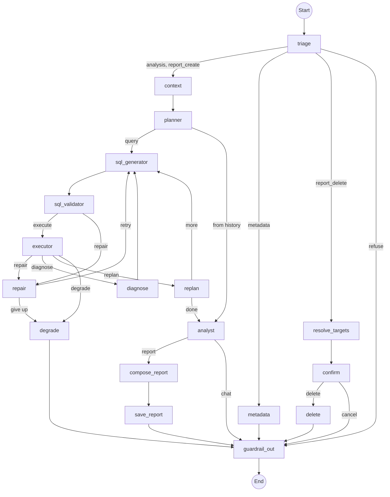

# Retail Analytics Agent

Natural-language questions → BigQuery SQL → analyst-quality reports for non-technical retail executives.

Built with LangGraph (explicit state graph, no black-box agents), Gemini 2.5 Flash, and a three-layer safety stack that ensures no LLM output reaches BigQuery unvalidated.

## Architecture



**18 nodes, one directed graph, fully explicit state transitions.** Every LLM call, query result, and routing decision is visible in the graph state. See [ARCHITECTURE.md](ARCHITECTURE.md) for design rationale.

## Quick start

### Demo mode (no credentials needed)

```bash
git clone <repo-url> && cd retail-analytics-agent
python -m venv .venv && source .venv/bin/activate
pip install -e ".[dev]"
make demo
```

Demo mode uses `FakeLLM` (keyword-aware scripted responses) and `FakeBigQuery` (CSV fixture data). No API keys, no GCP project, no network required.

### Live mode (Vertex AI + BigQuery)

```bash
cp .env.example .env
# Set your GCP project (must have Vertex AI and BigQuery APIs enabled):
#   GCP_PROJECT_ID=my-project-id
#   GCP_LOCATION=us-central1     (default)
# Authenticate:
gcloud auth application-default login
gcloud auth application-default set-quota-project my-project-id
make run
```

### Live mode (Gemini API key + DuckDB)

```bash
cp .env.example .env
# If you don't have a GCP project, use a free Gemini key instead:
#   GEMINI_API_KEY=...       (from https://aistudio.google.com/apikey)
#   OPENROUTER_API_KEY=...   (fallback)
make run
```

The agent auto-detects credentials in priority order:
1. `GCP_PROJECT_ID` → Vertex AI (Gemini 2.5 Flash) + real BigQuery
2. `GEMINI_API_KEY` → Gemini AI Studio + DuckDB (local SQL execution on fixtures)
3. No credentials → FakeLLM + FakeBigQuery (demo mode)

## Example session

```
╭──────────────────────────────────────────────────────────────╮
│ Retail Analytics Agent                                       │
│ Thread: 55609784c549  |  Mode: FakeLLM (demo)                │
│ Type exit or quit to end.                                    │
╰──────────────────────────────────────────────────────────────╯

You: What are the top product categories by revenue?

Agent: Based on the data provided, here are the key findings:
The results show the requested metrics across the analysed period.
[Demo mode — connect a real LLM for detailed analysis.]

You: Create a report from that

Agent: # Retail Performance Report
**Period:** 2023
## Findings
  1. Revenue totalled $459.93 across the analysed period
  2. Outerwear and Dresses are the highest-revenue categories
## Action Items
  1. Increase marketing spend on top-performing categories
  2. Investigate low conversion in underperforming segments
*Report saved (id: b39c93bdf0d5)*

You: What tables do you have?

Agent: I have access to the thelook_ecommerce dataset with these tables:
  order_items — Line items with sale prices and fulfillment status
  orders — Order headers (status, timestamps, item count)
  products — Product catalog (name, brand, category, cost, retail price)
  users — Customer demographics (age, gender, state, city, traffic source)
```

## Safety design

Three layers, each deterministic and non-bypassable:

| Layer | What it does | Where |
|-------|-------------|-------|
| **SQL AST validation** | Parses with sqlglot; rejects `SELECT *`, PII columns, disallowed tables, unfiltered `CROSS JOIN` | `safety/ast_rules.py` |
| **PII denylist** | Hard-coded column pairs `(table, column)` — never prompted | `safety/pii.py` |
| **Output scrubbing** | Regex-based email/phone/address/postal redaction on every response | `safety/pii.py:scrub_output` |

The SQL path is: **LLM → AST validate → dry_run → execute**. There is exactly one code path to BigQuery and it goes through both validation stages. `SELECT *` is always rejected because it cannot be column-checked.

### Budgets

Every turn is bounded: max 3 SQL repairs, 8 LLM calls, 15 GB scanned. Enforced in graph state, checked before each call. Exhausting any budget triggers graceful degradation, not a crash.

## How it works

1. **Triage** classifies intent (analysis, report_create, report_delete, metadata, refuse) and resolves follow-up references into standalone questions.

2. **Context** loads the safe schema (PII columns stripped), metric definitions, and retrieves relevant golden trios via TF-IDF similarity.

3. **Planner** decomposes complex questions into 1–3 SQL steps with dependency tracking. Causal questions ("why does X differ from Y?") get parallel queries followed by a dependent comparison step.

4. **SQL Generator → Validator → Executor** generates SQL grounded in schema + metrics + golden examples, validates the AST, dry-runs against BigQuery, then executes. Failed queries route to repair (up to 3 attempts) or degrade.

5. **Replan** checks whether intermediate results are sufficient or more queries are needed. Up to 2 replan rounds.

6. **Analyst** interprets results in business language. For report-create intents, routes to **Compose → Save** which produces structured findings + action items.

7. **Guardrail Out** scrubs PII from every response before it reaches the user.

### Report lifecycle

- **Create**: analysis results → LLM composition → structured report with findings and action items → persisted to ReportStore
- **Delete**: intent detected → targets resolved by ownership filter **in code** (`WHERE owner_id = :current_user`) → risk-tiered confirmation → soft delete with `deleted_at` tombstone + audit row in one transaction
- Target IDs are resolved **before** confirmation and deleted by those IDs **after** — the filter is never re-run post-confirmation

### Resilience

Five-level degradation ladder:

1. **Repair** — feed the error back to the LLM, retry SQL generation (up to 3 times)
2. **Diagnose** — distinguish empty-result causes (filter too narrow vs. no data)
3. **Replan** — discard failed step, ask whether remaining data suffices
4. **Degrade** — return a partial answer with an explanation of what failed
5. **Error state** — return a user-facing error message with a trace ID

The CLI never crashes. Every node is wrapped; unhandled exceptions become an error state with a user-facing message and a trace ID.

## Project structure

```
src/agent/
├── cli.py                  # Typer + Rich CLI with auto-detection
├── config.py               # pydantic-settings from .env
├── state.py                # AgentState TypedDict + Pydantic models
├── graph.py                # StateGraph wiring (18 nodes)
├── data/
│   ├── bigquery.py         # BigQueryClient Protocol + RealBigQuery + FakeBigQuery
│   ├── fake_bigquery.py    # DuckDBBigQuery (sqlglot transpilation, local SQL)
│   ├── semantic_layer.py   # Safe schema + metric definitions
│   └── golden_bucket.py    # TF-IDF retrieval over seed trios
├── llm/
│   ├── gateway.py          # LLMGateway Protocol + VertexAI/Gemini/OpenRouter/FakeLLM
│   └── circuit.py          # Circuit breaker for LLM calls
├── nodes/                  # One file per graph node
│   ├── triage.py           # Intent classification
│   ├── context.py          # Schema + metrics + trio retrieval
│   ├── planner.py          # Multi-step plan decomposition
│   ├── sql_generator.py    # SQL generation with repair context
│   ├── sql_validator.py    # AST validation gate
│   ├── executor.py         # Dry-run + execute + budget check
│   ├── repair.py           # Retry counter with bounded attempts
│   ├── replan.py           # Intermediate result evaluation
│   ├── analyst.py          # Result interpretation
│   ├── diagnose.py         # Empty result diagnosis
│   ├── degrade.py          # Five-level degradation
│   ├── metadata.py         # Schema/capability questions
│   ├── guardrail_out.py    # Output PII scrubbing
│   └── reports/
│       ├── compose.py      # LLM-driven report composition
│       ├── save.py         # Persist to ReportStore
│       ├── resolve.py      # Pre-confirmation target resolution
│       ├── confirm.py      # Risk-tiered confirmation gate
│       └── delete.py       # Soft delete + audit
├── safety/
│   ├── ast_rules.py        # sqlglot AST validation
│   └── pii.py              # PII denylist + output scrubbing
├── store/
│   ├── reports.py          # ReportStore Protocol + FakeReportStore
│   └── audit.py            # AuditEntry model + FakeAuditStore
├── prompts/
│   └── registry.py         # YAML loader with 60s TTL hot-reload
└── observability/
    └── tracing.py          # Trace ID generation

prompts/                    # Prompt templates (YAML, hot-reloadable)
├── triage.yaml
├── planner.yaml
├── sql_generator.yaml
├── analyst.yaml
├── replan.yaml
├── repair.yaml
├── compose_report.yaml
├── persona.yaml            # owner: business (editable without code change)
└── system.yaml

golden/trios/               # 13 seed question→SQL→result trios
semantic/metrics.yaml       # Metric definitions (revenue, AOV, etc.)
fixtures/                   # CSV data for FakeBigQuery
evals/safety_suite.yaml     # 50 adversarial safety eval cases
```

## Testing

```bash
make check    # lint + typecheck + 139 unit tests + 50 safety evals
make test     # unit tests only
make eval     # adversarial safety suite only
```

All tests run with `FakeLLM` and `FakeBigQuery` — no network, no credentials. The safety eval suite (`evals/safety_suite.yaml`) is a hard gate: 100% pass rate required.

Tests cover: SQL AST validation (PII, `SELECT *`, table allowlist, injection attempts), PII scrubbing (email, phone, address patterns), full graph traversal (read path, causal replanning, report lifecycle, delete flow, resilience/degradation), golden bucket retrieval, and persona hot-reload.

## Adapters and testing

Every external dependency is behind a Protocol with a real and a fake implementation:

| Protocol | Real | Local | Fake |
|----------|------|-------|------|
| `LLMGateway` | `VertexGateway`, `GeminiGateway`, `OpenRouterGateway` | — | `FakeLLM` |
| `BigQueryClient` | `RealBigQuery` (BigQuery SDK) | `DuckDBBigQuery` (sqlglot transpilation) | `FakeBigQuery` (CSV pattern-matching) |
| `ReportStore` | (Postgres impl) | — | `FakeReportStore` (in-memory) |
| `AuditStore` | (Postgres impl) | — | `FakeAuditStore` (in-memory) |

Injected via LangGraph's `config["configurable"]` dict — no global singletons, no monkey-patching.

## Prompt management

All prompts live in `prompts/*.yaml`, loaded through a registry with 60-second TTL hot-reload. Edit a prompt file while the agent is running; the next turn picks up the change without a restart.

Each prompt declares an `owner` field:
- `business` — persona, tone, and style prompts that non-developers can safely edit
- `dev` — SQL generation, planning, and system prompts that require developer review

## Extensibility

The graph-based architecture makes the agent extensible without modifying existing nodes:

- **Charts/visualisation**: add a `chart` node after `analyst` with a conditional edge based on response type. The node receives `query_results` from state and produces a chart artifact.
- **Email delivery**: add a `send_email` node after `save_report`. The report is already structured (title, period, findings, action items).
- **Web search**: add a `web_search` node as an alternative to `sql_generator` for questions outside the dataset scope. Route from `planner` based on question type.
- **New data sources**: implement the `BigQueryClient` Protocol for the new source. The SQL validator and executor work through the same interface. Add tables to `ALLOWED_TABLES` and `TABLE_SCHEMA` in `ast_rules.py`.

## Requirements coverage

Each requirement from the assignment is addressed below. Full design rationale, diagrams, and production considerations are in [ARCHITECTURE.md](ARCHITECTURE.md) (sections §4.1–§4.8).

| # | Requirement | Prototype | Design | Key files |
|---|-------------|-----------|--------|-----------|
| 1 | **Hybrid Intelligence** | 13 seed trios with TF-IDF retrieval. SQL generator receives relevant golden examples as few-shot context. | pgvector embeddings at scale, human-gated promotion pipeline for new trios. [§4.1](ARCHITECTURE.md) | `data/golden_bucket.py`, `golden/trios/`, `semantic/metrics.yaml` |
| 2 | **Safety & PII Masking** | Three deterministic layers: AST validation (sqlglot), column denylist, output scrubbing. Never prompted. | Cloud DLP for unstructured text, row-level security. [§4.2](ARCHITECTURE.md) | `safety/ast_rules.py`, `safety/pii.py`, `nodes/guardrail_out.py` |
| 3 | **High-Stakes Oversight** | Resolve targets before confirmation, soft-delete with audit trail, ownership filter in code. | `interrupt()` for real user confirmation, risk-tiered UX. [§4.3](ARCHITECTURE.md) | `nodes/reports/resolve.py`, `confirm.py`, `delete.py` |
| 4 | **Continuous Improvement** | Persona preferences in YAML. | User preference store (Postgres), system-level trio promotion from high-scoring interactions. [§4.4](ARCHITECTURE.md) | `prompts/persona.yaml`, `store/` |
| 5 | **Resilience** | Five-level degradation: repair → diagnose → replan → degrade → error state. Bounded budgets per turn. | Circuit breaker, Gemini → OpenRouter fallback. [§4.5](ARCHITECTURE.md) | `nodes/repair.py`, `nodes/degrade.py`, `llm/circuit.py` |
| 6 | **Quality Assurance** | 50 adversarial safety evals (100% gate), 139 unit tests, `make check` CI pipeline. | Groundedness judge (10%/100%), offline metric suite, human review workflow. [§4.6](ARCHITECTURE.md) | `evals/safety_suite.yaml`, `tests/` |
| 7 | **Observability** | Trace IDs on every error, structured logging, per-turn metrics in graph state. | Langfuse traces with span-level cost, Grafana dashboards, alerting. [§4.7](ARCHITECTURE.md) | `observability/tracing.py`, `config.py` |
| 8 | **Persona Management** | YAML prompts with 60s TTL hot-reload. `owner: business` prompts editable without code changes. | Langfuse Prompt Management with labelled versions. [§4.8](ARCHITECTURE.md) | `prompts/persona.yaml`, `prompts/registry.py` |

## Known limitations

- **Golden Bucket scale**: TF-IDF works for the 13-trio seed corpus. At 1000+ trios, replace with pgvector embeddings.
- **Semantic correctness**: `dry_run` validates syntax but not whether the query answers the question correctly. Mitigated by golden trios, not solved.
- **User preferences**: the persona YAML is per-deployment, not per-user. Production would store preferences in Postgres per user ID.
- **Confirmation flow**: the prototype auto-confirms low-risk single deletions. Production would use `interrupt()` for real user confirmation.
- **Circuit breaker**: implemented for LLM calls but not configurable per-model.
